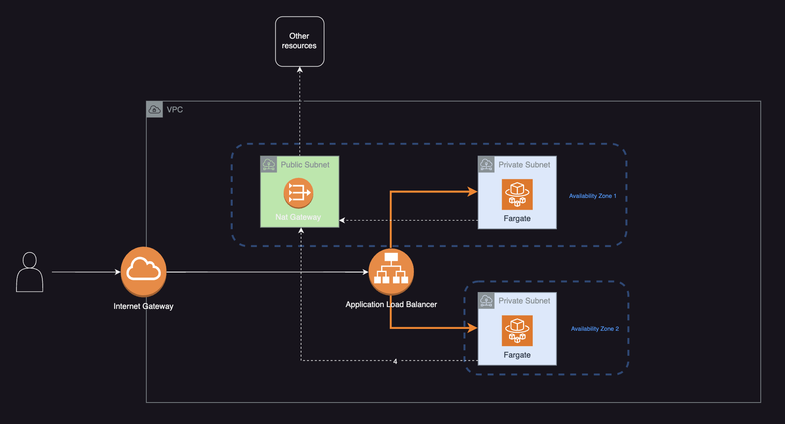

# ECS Fargate tasks in Private Subnets Demo

This is a demo project for the following architecture

It uses the docker image created by this project: https://github.com/chayanikaa/test-express-app

## To note about this project

- This project uses paid resources that do not have any free tier options: NAT Gateway, ECS Fargate, VPC Interface endpoints.
- This project uses a remote backend which is configured in the backend section of `main.tf`. This is configured using `bootstrap.tf` first.
  - First, this is configured using a local backend, once the bootstrap resources are created, the backend can be changed to use these resources and move the existing state to the remote backend.
  - S3 bucket names have to be unique across a region, so you'll probably need another name for `demo-private-ecs-terraform-state-1337`.